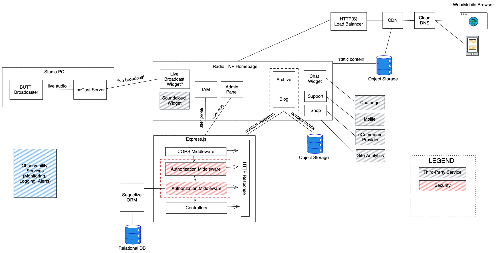
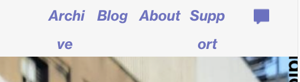

## Internet Radio Station

This is a work-in-progress prototype of a website for an community-run internet radio station based in Amsterdam

## Project goals:

- Responsive design
- JWT server-side Authentication (user/password)
- Blog page with blogpost create / update function for site moderators, delete function for site admins
- Mollie payment integration for supporter donations
- Bulk upload blogposts via JSON file for site admins
- Auto-DJ soundcloud widget
- Research Soundcloud <-> Archive user flow to see if it can be automated without access to Soundcloud API

## Relevant concerns:

- Maintability: high priority, because the technical team is small. Assets and data need to be editable by non-technical moderators.
- Cost: high priority. TNP is community-funded with a small budget so cost savings need to be top of mind.
- Scalability: low priority (for now). Assuming that TNP currently does not receive too many site visitors and not a huge difference between peak and off-peak traffic. (Check w Ozzy)
- Availability: low priority. Not the end of the world if the site is down an hour for maintenance.

## Proposed Architecture:

## Issue log for previous TNP website:

- Problems with responsive design, e.g. navbar text collapses to newline even on medium display size 
- Some data inconsistency on archive page, e.g. the Niall Rogers episode is titled "Marma Boog" 
- Chatango widget button only works on initial load of webpage. After navigating to another page, it doesn't work anymore, even if you return to homepage.
- Events not accessible from menu bar
- Infinite scroll of archive on homepage makes it difficult to reach the info in footer
- Clicking TNP logo when on homepage doesn't reload the page or scroll to top

## Commands

In the project directory, you can run:

### `npm start`

to run the app in the development mode.\
Open [http://localhost:3000](http://localhost:3000) to view it in the browser.

The page will reload if you make edits.\
You will also see any lint errors in the console.
